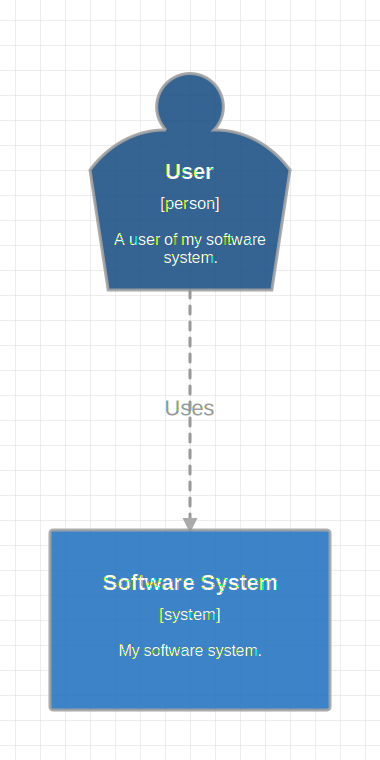
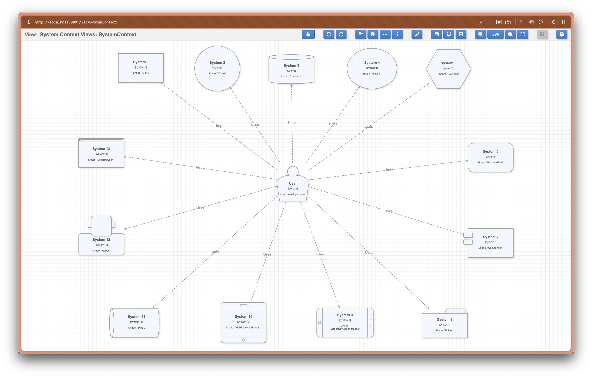

# Model

[](https://github.com/goadesign/model/actions?query=workflow%3ACI)


[](https://pkg.go.dev/goa.design/model@v1.7.9/dsl?tab=doc)
[](https://pkg.go.dev/goa.design/model)

## Overview

Model provides a way to describe software architecture models using
*diagrams as code*. This approach provides many benefit over the use of
 graphical tools, in particular:

* **Built-in history via source control versioning**: Each change to the software
  architecture model results in a commit making it natural to implement
  [Architectural Decision Records](https://adr.github.io/).
* **Simple and consistent reuse of shared architecture components**: The code
  of shared architecture components can be imported by other software
  systems. Apart from the obvious time saving a major advantage is ensuring
  that all references are automatically kept up-to-date as the shared
  architecture component evolves. The shared architecture component code can
  be versioned using traditional source code versioning techniques as well.
* **Consistent notation and visual styles**: The same mechanism used to import
  shared architecture diagram can also be used to import shared style
  definitions.
* **Ability to control drift between reality and diagrams**: Static code
  analysis allows writing tools that compare the software models with actual
  code to detect discrepencies (this repo does not provide such a tool at
  this time).

The Model DSL is implemented in [Go](https://golang.org/) and follows the
[C4 Model](https://c4model.com) to describe the software architecture. Using
Go to implement the DSL makes it possible to leverage Go packages to share
and version models. It also allows for extending or customizing the DSL by
writing simple Go functions.

The C4 (Context, Containers, Components and Code) model provides a clean and
simple set of constructs (software elements, deployment nodes and views) that
can be learned in minutes. The C4 model is very flexible and only focuses on
a few key concepts making it possible to express many different styles of
architectures while still adding value.

## Example

Here is a complete design describing a simple architecture model composed of
a user and a software system:

```Go
package design

import . "goa.design/model/dsl"

var _ = Design("Getting Started", "This is a model of my software system.", func() {
    var System = SoftwareSystem("Software System", "My software system.", func() {
        Tag("system")
    })

    Person("User", "A user of my software system.", func() {
        Uses(System, "Uses")
        Tag("person")
    })

    Views(func() {
        SystemContextView(System, "SystemContext", "An example of a System Context diagram.", func() {
            AddAll()
            AutoLayout(RankLeftRight)
        })
        Styles(func() {
            ElementStyle("system", func() {
                Background("#1168bd")
                Color("#ffffff")
            })
            ElementStyle("person", func() {
                Shape(ShapePerson)
                Background("#08427b")
                Color("#ffffff")
            })
        })
    })
})
```

This code creates a model containing two elements, a relationship, a single
view and some styling information. Running the `mdl` tool (see [installation
instructions](#installation) below) renders the following diagram:



Additional examples can be found in the
[examples](https://github.com/goadesign/model/tree/master/examples)
directory.

## Installation

Model uses Go modules and thus requires Go version 1.11 or greater. Assuming
a working installation of Go, the `mdl` and `stz` tools can be installed
using:

```bash
go install goa.design/model/cmd/mdl
go install goa.design/model/cmd/stz
```

## Usage

Model includes two command line tools supporting two different workflows:

* The `mdl` tool serves a graphical editor that makes it possible to
  position the elements and relationships in each view defined in the design.
  The graphical editor saves the rendered views as SVG files in a directory
  specified when running the tool. `mdl` can also generate a JSON
  representation of the model.

* The `stz` tool uploads the software architecture described in the DSL
  to the [Structurizr](https://structurizr.com) service. This service renders
  the model and includes a visual editor to rearrange the results (the tool
  takes care of keeping any change made graphically on the next upload).


> Diagram source code: [model.go](examples/usage/model/model.go)

Model also provides a [Goa](https://github.com/goadesign/goa) plugin so that
the design of APIs and microservices written in Goa can be augmented with a
description of the corresponding software architecture.

### Using `mdl`

The `mdl serve` command starts a local HTTP server that serves a graphical
editor. The command takes the Go import path to the package containing the
DSL as argument. The path to the directory used to save the SVG files can be
provided via the `-dir` flag, by default the editor creates a `gen` folder
under the current path. For example:

```bash
mdl serve goa.design/model/examples/basic/model -dir gen
Watching: /home/raphael/go/src/goa.design/model/examples/basic/model
Editor started. Open http://localhost:8080 in your browser.
```

Modifying and saving the DSL while the editor is running causes it to
automatically update and reflect the latest changes making it convenient to
work on the model while editing the view layouts.

The `mdl gen` command generates the JSON representation of a design, it accepts
the Go import path to the package containing the design DSL as argument. For
example the following command generates the JSON for the `basic` example

```bash
mdl gen goa.design/model/examples/basic/model -out design.json
```

The generated file `design.json` contains a JSON representation of the
[Design](https://pkg.go.dev/goa.design/model@v1.7.0/mdl#Design) struct.

### Using `stz`

Alternatively, the `stz` tool generates a file containing a
[JSON representation of a Structurize service workspace](https://github.com/structurizr/json)
that corresponds to the design described in the DSL. The tool can then upload
the workspace to the [Structurizr service](https://structurizr.com). The tool
can also retrieve the JSON representation of a workspace from the service.

This example uploads a workspace corresponding to the DSL defined in the Go
package `goa.design/model/examples/basic`:

```bash
stz gen goa.design/model/examples/basic/model
stz put workspace.json -id ID -key KEY -secret SECRET
```

In this example `ID` is the Structurizr service workspace ID, `KEY` the
Structurizr service API key and `SECRET` the corresponding secret.

The example below retrieves the JSON representation of a workspace from
Structurizr:

```bash
stz get -id ID -key KEY -secret SECRET -out workspace.json
```

### Using the Goa Plugin

This package can also be used as a [Goa](https://github.com/goadesign/goa)
plugin by including the DSL package in the Goa design:

```Go
package design

import . "goa.design/goa/v3/dsl"
import "goa.design/model/dsl"

// ... DSL describing API, services and architecture model
```

Running `goa gen` creates both a `design.json` and a `workspace.json` file in
the `gen` folder. The `workspace.json` file follows the
[structurizr JSON schema](https://github.com/structurizr/json) and can be
uploaded to the Structurizr service for example using the `stz` tool included
in this repo.

### Using Model as a library

The [mdl](https://pkg.go.dev/goa.design/model@v1.7.9/mdl?tab=doc) package
[RunDSL](https://pkg.go.dev/goa.design/model@v1.7.9/mdl?tab=doc#RunDSL)
method runs the DSL and produces data structures that contain all the
information needed to render the views it defines.

The [stz](https://pkg.go.dev/goa.design/model@v1.7.9/stz?tab=doc) package
[RunDSL](https://pkg.go.dev/goa.design/model@v1.7.9/stz?tab=doc#RunDSL)
method runs the DSL and produces a data structure that can be serialized into
JSON and uploaded to the [Structurizr service](https://structurizr.com).

The [stz](https://github.com/goadesign/model/tree/master/stz)
package also contains a client library for the
[Structurizr service APIs](https://structurizr.com/help/web-api).

Here is a complete example that uploads the design described in a DSL to the
Structurizr service:

```Go
package main

import (
    "fmt"
    "os"

    . "goa.design/model/dsl"
    "goa.design/model/stz"
)

// DSL that describes software architecture model.
var _ = Design("Getting Started", "This is a model of my software system.", func() {
    var System = SoftwareSystem("Software System", "My software system.", func() {
        Tag("system")
    })

    Person("User", "A user of my software system.", func() {
        Uses(System, "Uses")
        Tag("person")
    })

    Views(func() {
        SystemContextView(System, "SystemContext", "An example of a System Context diagram.", func() {
            AddAll()
            AutoLayout(RankLeftRight)
        })
        Styles(func() {
            ElementStyle("system", func() {
                Background("#1168bd")
                Color("#ffffff")
            })
            ElementStyle("person", func() {
                Shape(ShapePerson)
                Background("#08427b")
                Color("#ffffff")
            })
        })
    })
})

// Executes the DSL and uploads the corresponding workspace to Structurizr.
func main() {
    // Run the model DSL
    w, err := stz.RunDSL()
    if err != nil {
        fmt.Fprintf(os.Stderr, "invalid design: %s", err.Error())
        os.Exit(1)
    }

    // Upload the design to the Structurizr service.
    // The API key and secret must be set in the STRUCTURIZR_KEY and
    // STRUCTURIZR_SECRET environment variables respectively. The
    // workspace ID must be set in STRUCTURIZR_WORKSPACE_ID.
    var (
        key    = os.Getenv("STRUCTURIZR_KEY")
        secret = os.Getenv("STRUCTURIZR_SECRET")
        wid    = os.Getenv("STRUCTURIZR_WORKSPACE_ID")
    )
    if key == "" || secret == "" || wid == "" {
        fmt.Fprintln(os.Stderr, "missing STRUCTURIZR_KEY, STRUCTURIZR_SECRET or STRUCTURIZR_WORKSPACE_ID environment variable.")
        os.Exit(1)
    }
    c := stz.NewClient(key, secret)
    if err := c.Put(wid, w); err != nil {
        fmt.Fprintf(os.Stderr, "failed to store workspace: %s\n", err.Error())
        os.Exit(1)
    }
}
```

## DSL Syntax

### Rules

The following rules apply to all elements and views declared in a model:

* Software and people names must be unique.
* Container names must be unique within the context of a software system.
* Component names must be unique within the context of a container.
* Deployment node names must be unique with their parent context.
* Infrastructure node names must be unique with their parent context.
* All relationships from a given source element to a given destination element
  must have a unique description.
* View keys must be unique.

Note that uniqueness of names is enforced by combining the evaluated
definitions for a given element. For example if a model contained:

```Go
var Person1 = Person("User", "A user", func() {
    Uses("System 1", "Uses")
})
var Person2 = Person("User", "The same user again", func() {
    Uses("System 2", "Uses")
})
```

Then the final model would only define a single person named `"User"` with
the description `"The same user again"` and both relationships. This makes it
possible to import shared models and "edit" existing elements, for example to
add new relationships.

### References to Elements

Some DSL functions such as `Uses`, `Delivers`, `InteractsWith`, `Add` and
`Link` accept references to elements as argument. The references can be done
either through a variable (which holds the element being referred to) or by
the path of the element. The path of an element is constructured by appending
the parent element names separated by slashes (/) and the name of the
element. For example the path of the component 'C' in the container 'CO' and
software system 'S' is 'S/CO/C'. The path can be relative when the reference
is made within a scoped function, for example when adding an element to a
view that is scoped to a parent element.

### Resources

The DSL package
[documentation](https://pkg.go.dev/goa.design/model@v1.7.9/dsl?tab=doc) lists
all the DSL keywords and their usage.

The file [DSL.md](https://github.com/goadesign/model/blob/master/DSL.md)
illustrates the complete syntax in one design.

## Graphical Editor

The graphical editor is started using the `mdl serve` command. This command
accepts the import path to the Go package containing the model DSL. The
editor makes it possible to position the elements and their relationships in
each view.

The editor makes it possible to select a view described in the DSL and to
position its elements and relationships graphically. Multiple elements can be
selected by either dragging over the selection or by using SHIFT + CLICK.
Selecting multiple elements automatically selects the relationships between
these elements as well.

New vertices can be created on relationship lines using ALT + CLICK, existing
vertices can be deleted with BACKSPACE or DELETE. See the table below for a
complete list of editor shortcuts.

### Saving

The `Save View` button causes the editor to create a SVG rendering of the
currently edited view in the target directory (specified via the `-dir`
flag). The SVG encodes the positions of all the elements and relationships as
well so that restarting the editor using the same target directory
automatically restores the element positions.


> Diagram source code: [model.go](examples/shapes/model/model.go)

### Keyboard Shortcuts

The editor supports a number of keyboard shortcuts listed below:

| Category             | Shortcut                   | Effect                               |
| -------------------- | ---------------------------|------------------------------------- |
| Help                 | ?, SHIFT + F1              | Show keyboard shortcuts              |
| File                 | CTRL + S                   | Save SVG                             |
| History              | CTRL + Z                   | Undo                                 |
| History              | CTRL + SHIFT + Z, CTRL + Y | Redo                                 |
| Relationship editing | ALT + CLICK                | Add relationship vertex              |
| Relationship editing | ALT + SHIFT + CLICK        | Add label anchor relationship vertex |
| Relationship editing | DELETE, BACKSPACE          | Remove relationship vertex           |
| Zoom                 | CTRL + =, CTRL + wheel     | Zoom in                              |
| Zoom                 | CTRL + -, CTRL + wheel     | Zoom out                             |
| Zoom                 | CTRL + 9                   | Zoom - fit                           |
| Zoom                 | CTRL + 0                   | Zoom 100%                            |
| Select               | CTRL + A                   | Select all                           |
| Select               | ESC                        | Deselect                             |
| Move                 | UP                         | Move up                              |
| Move                 | SHIFT + UP                 | Move up fast                         |
| Move                 | DOWN                       | Move down                            |
| Move                 | SHIFT + DOWN               | Move down fast                       |
| Move                 | RIGHT                      | Move right                           |
| Move                 | SHIFT + RIGHT              | Move right fast                      |
| Move                 | LEFT                       | Move left                            |
| Move                 | SHIFT + LEFT               | Move left fast                       |

### TBD

While functional, the editor isn't considered feature complete yet. Here is
the list of features that will be added in the future:

- [x] Snap to grid
- [ ] Better SVG clipping on save
- [ ] Autolayout on start if no pre-existing layout information
- [ ] Support for both vertical and horizontal ranking with autolayout
- [ ] Keyboard shortcuts for vertical and horizontal align
- [ ] Autosave toggle
- [ ] Distribute horizontally and vertically
- [ ] Toolbar icons

### Examples

Refer to the
[examples](https://github.com/goadesign/model/blob/master/examples) directory
for working examples.
